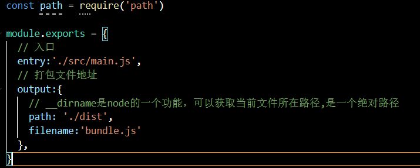
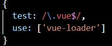
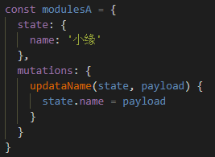

---

typora-copy-images-to: img
typora-root-url: README.assets
---

# VUE

## 一、认识Vue

​	（一）vue是一个渐进式框架，渐进式意味着你可以将vue作业的一部分嵌入其中。

​	（二）vue的特点和web开发常用的高级功能：解耦视图和数据、可复用的组件、前端路由技术、状态管理、虚拟DOM

## 二、初识

​	（一）、定义变量：let（变量） const（常量，不可赋值)
​							el 	//用于要挂载要管理的元素
​							data	//定义数据

## 三、列表显示

​	（一）、v-for  遍历数组	item in movies 指把movies遍历传到item里
​					也是响应式的

## 四、案例：计数器

​	（一）、methods，该属性用于在vue对象中定义方法
​	（二）、@click，该指令用于监听某个元素的点击事件，点击时执行该方法，是v-for的一个简写

## 五、语法

1.Mustache：{{内容}}

2.v-once：该指令后不需跟任何表达式，该指令表示元素和组件只渲染一次，不会随着数据改变而改变

3.v-html：url直接用{{}}输出，会将html代码一起输出，可以使用v-html，该指令后面往往会跟上一个string类型，将string的html解析出来并渲染，用于字符串有html标签的内容

4.v-text：类似于Mustache，一般不用

5.v-pre：将标签内的内容原封不动的输出，不做任何解析

6.v-cloak：在vue解析之前，div中有v-cloak属性，解析之后，div中v-cloak属性移除，v-cloak需要在css定义样式

7.v-bind：动态绑定url地址，,简写：“:”

8.v-bind：动态绑定class类名，

```vue
<h2 v-bind:class="{类名：true（为true则为这个类名) ，类名：flase（为flase则不为这个类名)}">{{message}}</h2>
```

一般不写在html里，写在data里定义一个属性，值为true/false，然后将属性名写在html中的true/false上

9.v-bind：动态绑定style（对象语法）

```vue
<h2 :style='{key（属性名):value（属性值)}'>{{message}}</h2>
```

10.v-bind：动态绑定style（数组语法）,bStyle为data里设置的变量

```vue
<h2 :style="[bStyle,bStyle1]">{{message}}</h2>
```

11.计算属性computed：和data同级，也是写函数在里面，调用的时候不需要（)，methods里写的函数调用需要加（)

12.methods里的函数多次调用需要执行多次，而computed里的函数多次调用只需执行一次

13.var / let创建变量，const创建常量，在es6开发时优先使用const，只有需要改变某一个标识符的时候才使用let（ )

14.const：常量的含义是指向的对象不能修改，但可以改变对内部的属性。

```js
const obj{
	name: 'abc',
	age: '18',
	height:'1.88'
}
obj.name= 'kobe',
obj.age= '40',
obj.height= '190'
```


15.v-on  click.stop修饰符：阻止冒泡

16.v-on  click.prevent修饰符：阻止默认事件

17.v-on  keyup：监听键盘键帽回弹

18.v-on keyip.q:监听Q键

19.v-if：当条件为false时，包含v-if指令元素，根本就不会存在dom中

20.v-show：当条件为false时，v-show只vft是给我们的元素添加一个行内样式：display：none

21.v-for 遍历数组 / 对象（v-for="item in info),item为名，infor为定义的数组名 / 对象名

22.v-for 插入key值

23.非响应式的方法和响应式方法：
push在最后添加元素,响应式，可一次性多加很多元素
this.letters.push（'aaa','bbb');

通过所以只修改数组元素，非响应式
this.letters[0] = 'bbbb'

pop删除最后以为数组元素，响应式
this.letters.pop（);

shift删除数组第一个元素，响应式
this.letters.shift（);

unshift在数组最前面添加元素，可一次性多加很多元素，响应式
this.letters.unshift（'111','222','333');

splice作用：删除元素 / 插入元素 / 替换元素，响应式
splice（[从第几个元素],[删除几个],[插入什么])
this.letters.splice（1,2,'6'); 

sort让数组排序
this.letters.sort（);

reverse将数组内容反转
this.letters.reverse（);

set（要修改的数组, 索引,修改后的值)
Vue.set（this.letters,  0 ,'abcdefg')

24.高阶函数：
filter（ )用于对数组进行过滤
map（ ) 方法创建一个新数组，其结果是该数组中的每个元素都调用一个提供的函数后返回的结果。
reduce（ )计算数组元素相加后的总和

25.v-model：双向绑定事件，改变其中一个值另一边也会同时改变

26.v-model：修饰符.lazy，让数据在失去焦点或回车时才更新

27.v-model：修饰符number，input输入框双向绑定默认为srtring属性，使用.number之后可以不用类型转换了

28.v-model：修饰符trim，去除input输入框内多余的空格

## 六、VUE组件

组件使用分为：创建组件构造器，注册组件，使用组件


props的传值（父传子）：


props的传值（子传父）：
		在子组件中，通过$emit（）来触发事件
		在父组件中，通过v-on来监听子组件事件

父子组件的访问方式：
		父组件访问子组件使用：$children
		子组件访问父组件使用：$paren
		子组件访问根组件使用：$root
		子组件访问父组件使用：$refs

插条slot的使用，在模板中加入<slot></slot>标签，标签内加入的为默认元素，如果有多个值，同时放入到组件进行替换时，会全部替换

模块化开发：给引用的js文件加type='module',让每个文件的变量不可互通，但是可以用export导出变量，再用import导入即可使用

特殊的export default导出，可以让导入者随意命名


## 七、webpack

### （一）、webpack的安装

​	1、需要有node.js文件，查询node.js版本命令为：node -v，然后在cmd管理员内安装webpack，（npm是node.js自带的软件包工具，3.6.0为版本号，-g表示全局安装）

```
npm install webpack@3.6.0 -g
```

查询webpack版本号命令

```
webpack --version
```

Ctrl + ~ 快捷方式打开终端

src文件夹为开发文件夹
dist为打包的文件夹

### （二）、webpack自动打包

​	1、手动创建webpack.config.js文件,里面创建path包，const path = require（"path")，可是文件内没有path包，需要安装，在当前目录的终端写npm init进行初始化，需要填写一些信息，package name 命名，version 版本号，description 描述，配置完成会出现一个package.json文件，当需要node的一些东西的时候就可以用得上。

!

​	2、在package.json文件中的scripts属性可定义脚本，当我们在终端使用npm run build,则调用 文件中scripts中的build，然后执行后面的内容：

```js
"build": "webpack"
```

这个webpack是优先在本地里找，在终端敲webpack是全局的。

局部安装webpack

```
npm install webpack@3.6.0 --save-dev
```

### （三）、loader

loader是webpack中的一个非常核心的概念

​	1、webpack是用来作什么的？
​		webpack会自动处理js之间相关的依赖。但是开发中不仅仅有js代码，也需要css、图片包括一些高级的将ES6转成ES5的代码，将scss、less转成css，将.jsx、.vue文件转成js文件等等。我们可以给webpack扩展对应的loader就可以了。

​	2、css-loader的使用过程：
​		（1）、通过npm安装需要使用的loader      

​		具体配置步骤：https://webpack.docschina.org/loaders/#styling

​		需要安装css-loader :

```
 npm install --save-dev css-loader@2.0.2
```

​		注意：css-loader只负责将css文件加载，不会进行解析
​		再安装style-loader负责将样式添加到MOD，解析 ：npm install --save-dev style-loader@0.23.1
​		注意：使用多个loader时，是从右到左进行读取的

​		（2）、在webpack.config.js中的modules关键字下进行配置

​	3、url-loader
​		（1）、url-loader是用来加载图片的loader，需要配置limit，limit值的计算为图片大小 （x）kb*1024，当加载的图片小于limit，会将图片编译成base64字符串形式，当大于limit，需要使用file-loader模块进行加载。
​		（2）、但是使用file-loader时会发现图片并没有显示出来，那是因为图片路径不对，需要在output对象下添加一个属性publicPath，值为' 打包的那个文件夹 + / '，例如publicPath : ' dist / '.
​		（3）、在url-loader配置中的options对象下加上 name属性，如：name:'img/[name].[hash:8].[ext]'，img/是新建文件夹，[name]表示使用打包之前的图片名称，‘ . ’表示连接，[hash]表示打包时创建的hash值，[hash:8]表示只取hash值的前八位，[ext]是拓展名。

### （四）、ES6语法处理

使用webpack打包时，它依然不会将ES6语法转换成ES5来打包，如果不转换，可能在一些浏览器上就无法使用，所以就需要安装babel，然后进行环境配置，再打包就能转换了。

```
npm install --save-dev babel-loader@7 babel-core babel-preset-es2015
```

## 八、引入vue.js

### （一）、添加vue

使用命令

```
npm install vue --save
```

在运用时，首先要依赖vue。

```js
import Vue from 'vue'
```

首次打包时，因为不支持template，所以需要在webpack中配置一些文件，不然就会报错

```js
module.exports = {
	resolve: {
		alias: {
			'vue$':'vue/dist/vue.esm.js'
		}
	}
}
```



1.runtime-only->代码中，不可以有任何的template

2.runtime-compiler->代码中，可以有template，因为有compiler可以用于编译template

### （二）、使用vue文件

创建一个.vue的文件，里面包含三个标签<template><script><style>，然后在入口的js文件中应用.vue文件,import XXX from '地址',

这样去打包肯定是报错的，因为webpack根本不认识它，所以要加载vue-loader 和 vue-template-compiler,命令是:

```
npm install vue-loader vue-template-compiler --save-dev，
```

最好是安装13.0.0的版本，高版本需要别的插件

安装完成之后配置!



## 九、plugin插件

### （一）、添加版权  Plugin

需要在webpack.config.js中配置，引用相关插件，这个插件是webpack自带的，所以去webpack中找，再配置module.exports

```js
const webpack = require （"webpack")
module.exports = {
  plugins: [
    new webpack.BannerPlugin('最终版权归属0329所有')
  ]
})
```

plugins:[new webpack.BannerPlugin（'XXXX')]，重新运行之后bunner.js中顶部出现版权信息。


### （二）、打包html  Plugin

现在index.html是放在根目录下，真实发布项目是打包在dist文件中的内容，如果dist中没有这个文件，那么打包js，vue等文件也就没有意义了，所有可以使用HtmlWebpackPlugin插件。
	1、HtmlWebpackPlugin插件可以为我们自动生成一个index.html文件，讲打包的js文件，自动通过script标签插入到body中
	2、安装HtmlWebpackPlugin插件：

```
npm install html-webpack-plugin@3.2.0 --save -dev
```

​	3、安装完之后，需要配置，在webpack.config.js中，先引用：

```js
const HtmlWebpackPlugin = require('html-webpack-plugin')
module.exports = {
  plugins: [
    new HtmlWebpackPlugin({
      template:'index.html'
    })
  ]
})
```

​	然后在plugins中配置：new HtmlWebpackPlugin()


### （三）、压缩js等文件  Plugin

用来压缩生成的文件，不占用太多空间

​	1、安装：

```
npm install uglifyjs-webpack-plugin@1.1.1 --save-dev
```

​	2、配置webpack.config.js文件，引用uglifyJsPlugin，然后在plugins添加配置

```js
const uglifyJsPlugin = require('uglifyjs-webpack-plugin')
module.exports = {
  plugins: [
    // 开发阶段是不需要丑化的，用在打包的时候
    new uglifyJsPlugin()
  ]
})
```


## 十、搭建本地服务器

webpack提供了一个可选的本地开发服务器，基于node.js搭建，内部使用express框架

### （一）、安装

```
npm install --save-dev webpack-dev-server@2.9.3
```

### （二）、配置文件

在webpack中的module.exports中配置：|

```js
module.exports = {
	devServer: {
		contentBase: './dist', //需要服务的文件夹
		inline: true, //是否实时监听
	}
}
```

在package.json中设置快捷命令，open是运行之后自动打开，然后执行命令为;npm run dev

```
"dev": "webpack-dev-server --open"
```


### （三）、配置分离

​	1、当webpack.config.js中的配置文件过多时，有开发时需要的，有编译打包时需要的，所以我们需要将他们进行抽取分离出来

​	2、分离出来之后需要安装webpack中的一个插件:

```
npm install webpack-merge@4.1.5 --save-dev
```

​	然后导入插件，和导入你需要合并的文件

```
const webpackMerge = require('webpack-merge')
```

​	再将总配置和抽取出来的文件进行合并：

```js
module.exports = webpackMerge( 文件名 ,{
	//配置
})
```


## 十一、VUE CLI

### （一）、VUE CLI 使用前提

​	Node.js的安装。

```
检测node版本：node -v，检测npm版本:npm -v
webpack的全局安装。npm install webpack -g
```

​	脚手架的全局安装。

```
npm insatll -g @vue/cli@3.2.1
```

这安装的是脚手架3，当你还想使用脚手架2就要安装脚手架2的模板。

```
npm install @vue/cli-init -g
```

​	Vue CLI2初始化项目：

```
vue init webpack my-project
```

​	

###   （二）、脚手架2的使用

​	1、生成脚手架2的模板

```
vue init webpack XXX（自定义包名）
```

​	2、输入信息

```
	Project name -- 项目名（尽量不用中文，不包含
	Project description -- 描述信息
	Author -- 作者
	Vue build -- 构建项目选择，Runtime + Compiler推荐，Runtime-only更好
	Install vue-router？（y/n) -- 路由
	use ESLint to lint your code -- 对代码进行限制，不规范会报错
	Pick an ESLint preset -- 选择你想要的规范，Standard标准，Airbnb爱彼迎公司，none自己配置
	Set up unit tests -- 单元测试
	Setup e2e tests with Nightwatch -- 使用Nightwatch设置e2e测试，e2e->end to end（端到端测试）
	Should we run `npm install` for you after the project has been created? -- 选择管理工具
```

### （三）、脚手架3的使用

- 生成脚手架3的模板


```
vue create testvuecli3
```

- 填写信息


- 脚手架3的配置，另外还可在本地的项目管理系统配置 ↓


```
vue ui
```

- 还需修改其他配置，在当前目录添加vue.config.js文件

- 文件夹
  - assets（资源），这个文件夹中放项目中用到的各种资源，包括图片和css等。
  - components（组件），里面放一些公共的组件、router存放路由
  - store ，放置vueX状态公共管理相关内容
  - views（视图），这里可以对组件进行一些细分，做成一个一个的视图，以减轻components的代码量
  - router（路由），里面放置路由相关的东西
  - network，网络配置相关文件
  - vue.config.js，配置别名

## 十二、箭头函数

### （一）、基本使用

写法

```js
const 变量名 = (参数) => {

}
```

1、参数问题

​	1.1、放入两个参数

```js
const sum = (sum1, sum2) => {
	return num1 + num2
}
```

​	1.2、放入一个参数

```js
const sum = (sum) => {
	return num * num
}
//或者
const sum = sum => {
	return num * num
}
//当只有一个参数时可以省略括号
```

2、返回值

​	2.1、只有一行返回值代码时，有简写

```javascript
const mul = (num1, num2) => {
    return num1 * num2
}
//变成
const mul = (num1, num2) => num1 * num2
```

3、this的使用

```js
<script>
    //个人理解：只要上级或者自己是function，this为window对象，上级和自己都是箭头函数，this则是自定义对象obj
    const obj = {
        
      aaa(){
        setTimeout(function (){
          setTimeout(function (){
            console.log(this);//window
          })
          
          setTimeout(() => {
            console.log(this);//window
          });
        })

        setTimeout(() => {
          setTimeout(function (){
            console.log(this);//window
          })

          setTimeout(() => {
           console.log(this);//obj
          });
        });
      }
    }
    obj.aaa();
</script>
```

## 十三、路由vue-router

### （一）、什么是路由

路由就是通过互联的网络把信息从原地址传输到目的地地址的活动

路由中有一个非常重要的概念叫路由表，路由表本质上就是一个映射表，决定了数据包的指向

### （二）、后端路由阶段

后端处理URL和页面之间的映射关系。

### （三）、前后端分离阶段

浏览器中显示的页面中的大部分内容，都是由前端写的js代码在浏览器中执行，最终渲染出来的页面。

### （四）、SPA页面

SPA：单页面富应用

特点：在前后端分离的基础上加了一层前端路由，也就是前端来维护一套路由规则。

核心：改变URL，但页面不进行整体刷新。

​	1、不刷新页面但改变URL

​		通过hash来改变

```
location.hash = 'xxx'
```

​		通过HTML5的history

```js
history.pushState({},'','home')
//浏览器会记录你浏览过的页面，可以back
```

​		通过HTML5的history

```js
history.replaceState({},'','abc')
//replace是替换的意思，浏览器不会记录你浏览过的页面，不能back回去
```

​	2、前进、后退

​		back

````js
history.back
//返回上一级页面
````

​		go

````````js
history.go() 
//可以填写参数，-1等同于back，返回上级。可go正负数
````````

​		forward

```js
history.forward()
//等同于history.go(1)，类似于前进
```

### （五）、安装和使用vue-router

​	（一）、安装

```
npm install vue-router --save
```

​	（二）、配置VueRouter相关信息

​		1、在src文件夹下创建router文件夹，再创建index.js文件，首先导入VueRouter

```js
import VueRouter from 'vue-router'
```

​		2、通过Vue.use(插件)，安装插件

```js
Vue.use(VueRouter)
//记得先导入Vue
```

​		3、创建VueRouter对象

```js
const routes = [
   //把routes对象抽离出来 
]
const router = new VueRouter({
	//配置路径和组件之间的应用关系
	routes
})
//route：一个路由信息对象，routes：一组路由对象信息，router：路由控制对象
```

​		4、将router对象传入到vue实例

```js
export default router
```

​		5、使用vue-router的步骤

```js
//1、创建路由组件
//2、配置路由映射：组件和路径映射关系
//3、使用路由：通过<router-link>和<router-view>
<div id="app">
    <router-link to='/home'>首页</router-link>
    <router-link to='/about'>关于</router-link>
    <router-view></router-view>
  </div>
```

### （六）、重定向

```js
{
	path:'',
	redirect:'/home'
    //重定向redirect
}
```

### （七）、history模式

```js
//在导出之前加上
mode: 'history'
```


### （八）、router-link补充

- tag属性，router-link默认是a标签，当你想要改变时，需要使用tag属性


```html
<router-link to='/home' tag="button">abc</router-link>
```

- replace属性，不会留下history记录，不能返回上一级


```html
<router-link to='/Aq' replace>123</router-link>
```

- linkActiveClass属性，给活跃的添加class属性，用于批量修改样式，是路由属性中的一个


```js
linkActiveClass: 'active'
```

### （九）、通过代码的方式跳转

```html
<div id="app">
	<button @click="homeClick">又甘又刻</button>
    <button @click="aboutClick">刻晴</button>
    <button @click="Aq">啊晴</button>
    <router-view class="body1"></router-view>
</div>

<script>
	export default {
		name: 'App',
      	methods: {
    		homeClick() {
      			this.$router.push('/home')
                //push => pushState
                //不能back回来
                this.$router.replace('/home')
    		},
    		aboutClick() {
				this.$router.push('/about')
            },
            Aq() {
                this.$router.push('/Aq')
            }
  		}
	}
</script>
```

### （十）、params动态路由

- 例如：localhost:8080/user页面时，你想在user后拼接一个用户名


```js
//使用params来传递
//1、创建vue实例
//2、引用到router/index.html中
{
	path: '/User/:abc',
	component: User
 }
//3、使用v-bind来动态绑定
<div>
    <router-link v-bind:to="'/User/'+userID">用户</router-link>
</div>

<script>
	export default {
		name: 'App',
		data() {
    		return {
      			userID: '刻晴',
    		};
  		}
   	}
</script>
//4、页面想获取这个路径名，在需要获取这个值的页面
export default {
   name:"User",
   computed: {
     userId() {
       return this.$route.params.abc
     }
   } 
}
//也可以直接在页面上拿
{{$route.params.abc}}
```

### （十一）、懒加载

- 在导入之前，将导入的代码改成懒加载新式就可以了


```js
const Home = () => import('../components/Home.vue')
const About = () => import('../components/About.vue')
```

### （十二）、路由子组件

- ​	首先创建子组件，将子组件懒加载导入到路由里，然后在路由的父组件下创建children：[] 数组，数组中包含子组件对象，创建完对象之后到父组件中使用子组件


```js
//1、创建
//2、
const Home = () => import('../components/Home.vue')
const HomeNews = () => import('../components/HomeNews.vue')
//3、
const routes = [
    {
		path: '/Home',
        component: Home,
        children: [
      		{
                path: 'news',
                component: HomeNews
            },
            {
             	path: 'message',
                component: HomeMessage
      		}
    	]
  	}
]
//4、
<router-link to='/home/news'>新闻</router-link>
<router-link to='/home/message'>消息</router-link>
<router-view></router-view>
```

### （十三）、query动态路由


```js
//第一种方法
//1、使用query对象写入你想要显示在URL上的信息，path：'/profile'=直接to一个路径
<router-link :to="{path:'/profile',query:{name:'刻晴' ,age:18 ,height:1.88}}">档案</router-link>
//2、然后和params一样的方法拿到数据
<h2>姓名：{{$route.query.name}}</h2>
<h2>年龄：{{$route.query.age}}岁</h2>
<h2>身高：{{$route.query.height}}CM</h2>

//第二种方法
//1、使用点击事件
<button @click='userClick'>用户</button>
<button @click='profileClick'>档案</button>

export default {
  data() {
    return {
      userId: '刻晴',
    };
  },
  methods: {
    userClick() {
      this.$router.replace('/User/' + this.userId)
    },
    profileClick() {
      this.$router.replace({
        path: '/profile',
        query:{
          name:'刻晴' ,age:18 ,height:1.88
        }
      })
    }
  }
}
```

### （十四）、$router 和 $route的区别

- `this.$router`是VueRouter的实例方法，当导航到不同url，可以使用`this.$router.push`方法，这个方法则会向history里面添加一条记录，当点击浏览器回退按钮或者`this.$router.back()`就会回退之前的url。
- `this.$route`相当于当前激活的路由对象，包含当前url解析得到的数据，可以从对象里获取一些数据，如name,path,params,query等。

### （十五）、生命周期函数


```js
export default {
  //当组件被创建时，会执行，只触发一次
  created() {
    console.log('创建'); 
  }，
  //当组件被销毁时，执行
  destroyed () {
    console.log('销毁');
  },
}
```

### （十六）、导航守卫

当你需要给你每个组件的页面修改title时，可以使用路由导航，不需要大量修改代码

```js
//1、全局守卫，首先在路由的index.js中给每个组件添加meta标签
meta: {
	title:'用户' 
}
//然后调用beforeEach方法，注意：需要在导出之前调用，不然会找不到router
//beforeEach：前置钩子，跳转之前的操作，next（）必须调用
router.beforeEach((to, from, next) => {
  next();
  document.title = to.matched[0].meta.title
  console.log(to);
})
//to：即将要进入的目标的路由对象
//from：当前导航即将要离开的路由对象
//next：调用该方法后，才能进入下一个钩子
//2、路由独享守卫
//在路由内使用
beforeEnter: (tp, form, next) => {
  alert("刻晴最可爱")
}
//3、组件守卫
beforeRouteEnter(to, from, next) {
  // 在渲染该组件的对应路由被 confirm 前调用
  // 不！能！获取组件实例 `this`
  // 因为当守卫执行前，组件实例还没被创建
},
beforeRouteUpdate(to, from, next) {
  // 在当前路由改变，但是该组件被复用时调用
  // 举例来说，对于一个带有动态参数的路径 /foo/:id，在 /foo/1 和 /foo/2 之间跳转的时候，
  // 由于会渲染同样的 Foo 组件，因此组件实例会被复用。而这个钩子就会在这个情况下被调用。
  // 可以访问组件实例 `this`
},
beforeRouteLeave(to, from, next) {
  // 导航离开该组件的对应路由时调用
	// 可以访问组件实例 `this`
}
```

### （十七）、keep-alive标签

- keep-alive是Vue内置的一个组件，可以使被包含的组件保留状态，或避免重新渲染。


- `include` - 字符串或正则表达式。只有名称匹配的组件会被缓存。

- `exclude` - 字符串或正则表达式。任何名称匹配的组件都不会被缓存。


```html
<keep-alive include="acb,def0">
      <router-view></router-view>
</keep-alive>
```

## 十四、Promise

### （一）、什么是Promise

- Promise是异步编程的一种解决方案


### （二）、Promise编程

```js
//模板：
//resolve, reject 本身就是函数
new Promise((resolve, reject) => {
  //第一次网络请求
  setTimeout(() => {
        resolve()
      }, 1000);
	}).then(() => {
  		//第一次拿到结果的处理代码
      console.log('aaaaa');
      console.log('aaaaa');

      new Promise((resolve, reject) => {
        //第二次请求
        setTimeout(() => {
          resolve()
        }, 1000);
      }).then(() => {
        //第二次拿到结果的处理代码
        console.log('bbbb');
        console.log('bbbb');

        new Promise ((resolve, reject) => {
          //第三次请求
          setTimeout(() => {
          resolve()
          }, 1000);
        }).then(() => {
          //第三次拿到结果的处理代码
          console.log('ccc');
          console.log('ccc');

        })
      })
    })
```

```js
//实现简单传参
new Promise ((resolve, reject) => {
	setTimeout(() => {
    // 请求成功时调用
    resolve("成功了,cool啊")

    // 请求失败时调用
		reject("失败了，low啊")
  }, 1000);
}).then((aaa) => {
  //成功时接then
  	console.log(aaa);
  	console.log(aaa);
}).catch((we) => {
  //失败时接catch
  	console.log(we);
  	console.log(we);
})

//第二种写法
new Promise ((resolve, reject) => {
	setTimeout(() => {
  	// resolve('成功了')
    reject('失败了')
  }, 1000);
}).then(data => {
		console.log(data);
  //成功了
	},eer => {
		console.log(eer);
  //失败了
})

//第三种写法
new Promise ((resolve, reject) => {
	setTimeout(() => {
    	resolve('aaa')
  	}, 1000);
	}).then(res => {
  	console.log(res,'第一次处理');
		return Promise.resolve(res + '111')
	}).then(res => {
  	console.log(res,'第二次处理');
		return Promise.resolve(res + '222')
	}).then(res => {
  	console.log(res, '第三次处理');
})

//第四种写法，省略Promise.resolve
new Promise ((resolve, reject) => {
	setTimeout(() => {
		resolve('aaa')
	}, 1000);
}).then(res => {
    console.log(res,'第一次处理');
    return res + '111'
}).then(res => {
    console.log(res,'第二次处理');
		return res + '222'
}).then(res => {
    console.log(res, '第三次处理');
  	//抛出异常简写
  	throw 'eee'
}).catch(eer => {
  consoloe.log(eer)
})
```

### （三）、Promise的三种状态

- pending：等待状态，比如正在进行网络请求，或者定时器没有到时间。

- fulfill：满足状态，当我们主动回调了resolve时，就处于该状态，并且会回调 .then()

- reject：拒绝状态，当我们主动回调了reject时，就处于该状态，并且会回调 .catch()


## 十五、Vuex

- Vuex是一个专为Vue.js应用程序开发的状态管理模式。类似于状态库的东西，存储某种状态，共互不相干的两个组件之间数据的共享传递等
- 在src下创建store文件夹再创建index.js文件，里面用来存放公共数据
- 

### （一）、掌握Vue.js devtools插件

- ###### Vue.js devtools

  - Vue.js devtools为浏览器的一个插件，用来更直观的查看网页中的组件结构，用来调试。

### （二）、Mutations

- Mutations方法里装着一些改变数据的集合，把处理数据逻辑方法的全部放在mutations里面，使得数据和视图分离。

  - 格式：

  - ```js
    mutations: {
      方法名(state) {}
    }
    ```

  - Mutation主要包括两部分：
    - 字符串的事件类型（type）
    - 一个回调函数（handler），该回到函数的第一个参数就是state

  - Mutation的定义方式：

  - 通过Mutation更新

  - 在通过Mutation更新数据的时候，希望携带一些额外的参数

  - 参数被称之为是Mutation的载荷（payload）

  - 

  - Mutation响应规则
    - Vuex的store中的state是响应式的，当state中的数据发生改变时，vue组件会自动更新
    - 这就要求我们必须遵守一些vuex对应的规则：
      - 提前在store中初始化好所需要的属性
      - 当给state中的对象增加新属性时，使用下面的方式：
        - 方式一：使用Vue.set(obj, 'newprop', 123)
        - 方式二：用新对象给旧对象重新赋值
        - 

```JavaScript
//1、存放数据的index.js
const store = new Vuex.Store({
//state：类似于vue中的data，状态库中的数据都放在state中，外部读取数据时，也是从中读取的数据
  state: {
    counter: 1000
  },
	//mutations：里面写一些方法供我们来更改state中的数据，需要配合commit使用。
  mutations: {
    increment(state) {
      state.counter++
    },
    decrement(state) {
      state.counter--
    }
  }
})
//2、在你想要导出数据的界面，定义方法，需要使用commit渲染出数据
<template>
  <div id="app">
    //如果不需要修改可以直接$store.state.counter来使用
    <h2>{{$store.state.counter}}</h2>
    <button @click="addition">+</button>
    <button @click="subtraction">-</button>
    <hello-vuex :counter="$store.state.counter"></hello-vuex>
  </div>
</template>
export default {
    methods: {
    addition() {
      this.$store.commit('increment')
    },
    subtraction() {
      this.$store.commit('decrement')
    }
  }
}
```

### （三）、Getters

- getters方法可以当做是store的计算属性，有默认参数state。

  - 格式：

  - ```js
    getters: {
      方法名(state) {}
    }
    ```

### （四）、Actions

- 可以理解为基于Mutation的基础上，actions可以包含任意异步操作。

  - 格式：

  - ```js
    actions: {
      方法名(context) {}
    }
    ```

- index.js                                                   App.vue

- 

- actions的方法后可以接Promise来返回值

- 

### （五）、Module

- 当应用变得非常复杂时，store对象就可能变得相当臃肿，而module就是来解决这个问题的，vuex允许我们将store分割成模块，而每个模块拥有自己的state、mutations、actions等等。
- index.js
- App.vue

## 十六、axios

### （一）、安装和使用

- 安装：

  - ```
    npm insatll axios
    ```

- 基本使用：

  - 导入：

    - ```
      import axios from 'axios'
      ```

  - 接收数据：

    - ```js
      //axios支持Promise，可以直接使用then
      //默认get请求
      axios({
        url: ''
      }).then()
      ```

    - 
    
  -  params：
  
    - 

### （二）、axios并发请求

- 使用axios.all([ ])
  - 


### （三）、常见的配置选项

- 请求地址
  - url: '/user'
- 请求类型
  - method: 'get'
- 请求路径
  - baseUrl: 'http://www.mt.com/api'
- 请求前的数据处理
  - transformRequest: [function(data) {} ]
- 请求后的数据处理
  - transformResponse: [function(data) {} ]
- 自定义的请求头
  - headers: {'x-Requested-With' : 'XMLHttpRequest'}
- URL查询对象
  - params: {id: 12}
- 查询对象序列化函数
  - paramsSerializer: function(params) { }
- request body
  - data: {key: 'aaa'}
- 超时设置
  - timeout: 1000
- 跨域是否带Token
  - withCredentials: flase
- 自定义请求处理
  - adapter: function(resolve, reject, config) {}
- 身份验证信息
  - auth: {uname: '',pad : '12'}
- 响应的数据格式json / blob.document / arraybuffer / text /stream
  - responseType: 'json'

### （四）、创建axios实例

```js
//创建
const [name] = axios.create({
  baseURL: '',
  timeout: 1000
})
//使用
[name]({
  url: '',
  params: {
    type: 'pop',
    page: 1
  }
}).then(res => {
  console.log(res)
})
```

### （五）、使用拦截器

- axiso提供了拦截器，用于我们在发送每次请求或者得到响应后，进行对应的处理

## 十七、各种功能的应用

### （一）、事件总线

1. EventBus的简介：

   - `EventBus` 又称为事件总线。在Vue中可以使用 `EventBus` 来作为沟通桥梁的概念，就像是所有组件共用相同的事件中心，可以向该中心注册发送事件或接收事件，所以组件都可以上下平行地通知其他组件，但也就是太方便所以若使用不慎，就会造成难以维护的灾难，因此才需要更完善的Vuex作为状态管理中心，将通知的概念上升到共享状态层次。

2. 初始化（使用），这种方式初始化的 `EventBus` 是一个 **全局的事件总线** 

   1. 第一种方式：新建一个js文件

      - ```js
        // event-bus.js
        import Vue from 'vue'
        export const EventBus = new Vue()
        ```

   2. 第二种方式：直接在项目中的main.js中直接初始化

      - ```js
        // main.js
        Vue.prototype.$EventBus = new Vue()
        ```

3. 发送事件（现在我们已经创建了 `EventBus` ，接下来你需要做到的就是在你的组件中加载它，并且调用同一个方法，就如你在父子组件中互相传递消息一样。）

   1. 假设有两个子组件：DecreaseCount和IncrementCount，分别绑定了decrease() 和 increment()两个方法。这两个方法做的事情很简单，就是数值递增、减，以及角度值递增、减，在这两个方法中，通过EventBus.$emit(channel: string, callback(payload1,...))监听decreased和incremented频道。

   2. ```vue
      <!-- DecreaseCount.vue -->
      <template>
          <button @click="decrease()">-</button>
      </template>
      
      <script> import { EventBus } from "../event-bus.js";
          export default {
              name: "DecreaseCount",
              data() {
                  return {
                      num: 1,
                      deg:180
                  };
              },
              methods: {
                  decrease() {
                      EventBus.$emit("decreased", {
                          num:this.num,
                          deg:this.deg
                      });
                  }
              }
          }; 
      </script>
      
      <!-- IncrementCount.vue -->
      <template>
          <button @click="increment()">+</button>
      </template>
      
      <script> import { EventBus } from "../event-bus.js";
          export default {
              name: "IncrementCount",
              data() {
                  return {
                      num: 1,
                      deg:180
                  };
              },
              methods: {
                  increment() {
                      EventBus.$emit("incremented", {
                          num:this.num,
                          deg:this.deg
                      });
                  }
              }
          };
       </script>
      ```

4. 接收事件（现在我们可以在组件 App.vue 中使用 EventBus.$on(channel: string, callback(payload1,…))监听 DecreaseCount 和 IncrementCount 分别发送出了 decreased 和 incremented 频道。）

   1. ```vue
      <!-- App.vue -->
      <template>
          <div id="app">
              <div class="container" :style="{transform: 'rotateY(' + degValue + 'deg)'}">
                  <div class="front">
                      <div class="increment">
                          <IncrementCount />
                      </div>
                      <div class="show-front"> {{fontCount}} </div>
                      <div class="decrement">
                          <DecreaseCount />
                      </div>
                  </div>
      
                  <div class="back">
                      <div class="increment">
                          <IncrementCount />
                      </div>
                      <div class="show-back"> {{backCount}} </div>
                      <div class="decrement">
                          <DecreaseCount />
                      </div>
                  </div> 
              </div>
          </div>
      </template>
      
      <script>
          import IncrementCount from "./components/IncrementCount";
          import DecreaseCount from "./components/DecreaseCount";
          import { EventBus } from "./event-bus.js";
          export default {
              name: "App",
              components: {
                  IncrementCount,
                  DecreaseCount
              },
              data() {
                  return {
                      degValue:0,
                      fontCount:0,
                      backCount:0
                  };
              },
              mounted() {
                  EventBus.$on("incremented", ({num,deg}) => {
                      this.fontCount += num
                      this.$nextTick(()=>{
                          this.backCount += num
                          this.degValue += deg;
                      })
                  });
                  EventBus.$on("decreased", ({num,deg}) => {
                      this.fontCount -= num
                      this.$nextTick(()=>{
                          this.backCount -= num
                          this.degValue -= deg;
                      })
                  });
              }
          }; 
      </script>
      ```

      
